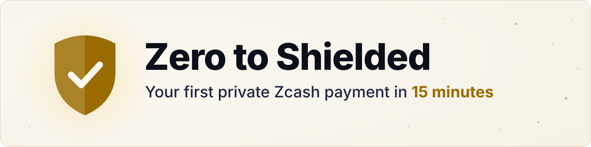
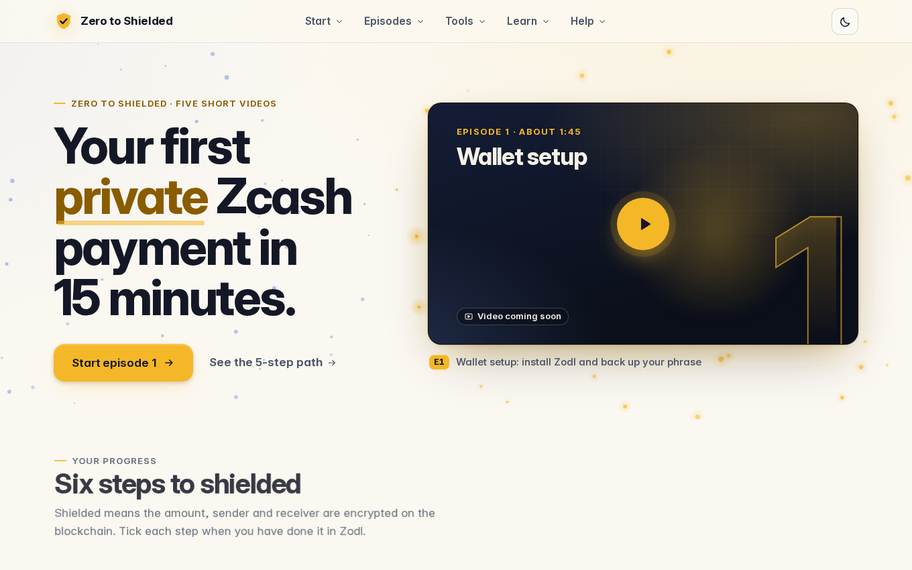
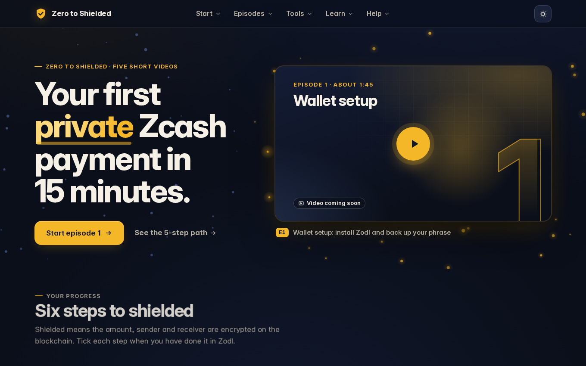
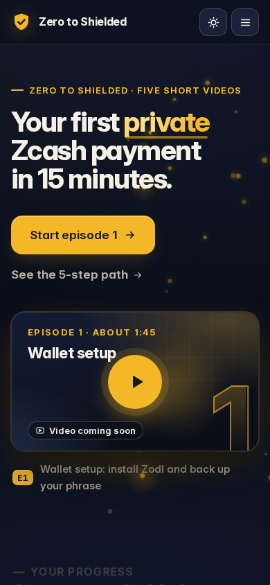

  <picture>
    <source media="(prefers-color-scheme: dark)" srcset="docs/img/banner-dark.svg">
    <source media="(prefers-color-scheme: light)" srcset="docs/img/banner-light.svg">
    
  </picture>

  <a href="https://zero-to-shielded.vercel.app/episodes/"><b>Watch</b></a>
  &nbsp;·&nbsp;
  <a href="https://zero-to-shielded.vercel.app/"><b>Try the site</b></a>
  &nbsp;·&nbsp;
  <a href="https://zero-to-shielded.vercel.app/tools/address/"><b>Tools</b></a>
  &nbsp;·&nbsp;
  <a href="#how-it-was-built"><b>How it was made</b></a>

Zero to Shielded is a short video series plus a companion website: **15 minutes** from no wallet to your first shielded payment. You use Zodl, a Zcash wallet for your phone. Older guides call it Zashi. A shielded payment hides the details on the blockchain. A transparent one is public, like Bitcoin. Episodes 1 to 4 cover the four topics of the ZECATHON Wildcard brief: wallet setup, getting ZEC, shielding and unshielding, sending and receiving. Each episode does one job and ends with your next step. The site hosts every episode. A checklist keeps your progress in your own browser.

## Watch

| # | Title | Length | Link |
|---|---|---|---|
| E0 | Zero to Shielded in 5 videos (trailer) | 0:25 | [Watch E0](https://zero-to-shielded.vercel.app/episodes/e0/) |
| E1 | Wallet setup: install Zodl and back up your phrase | 2:00 | [Watch E1](https://zero-to-shielded.vercel.app/episodes/e1/) |
| E2 | Getting ZEC: swap in the app or buy on an exchange | 1:59 | [Watch E2](https://zero-to-shielded.vercel.app/episodes/e2/) |
| E3 | Shielding and unshielding | 2:03 | [Watch E3](https://zero-to-shielded.vercel.app/episodes/e3/) |
| E4 | Sending and receiving: your first shielded transaction | 1:56 | [Watch E4](https://zero-to-shielded.vercel.app/episodes/e4/) |
| E5 | Stay private: five habits | 1:16 | [Watch E5](https://zero-to-shielded.vercel.app/episodes/e5/) |

## The site

  
  
  

- [Address checker](https://zero-to-shielded.vercel.app/tools/address/): paste an address to see what kind it is and whether its checksum is valid. Nothing you paste leaves your browser.
- [What the blockchain sees](https://zero-to-shielded.vercel.app/tools/chain/): a transparent send next to a shielded one.

## What is real and what is illustrated

| On screen | What it is |
|---|---|
| Wallet steps | Step diagrams with the exact Zodl button names, taken from the app's own source strings. There is no app footage yet. Each diagram carries the label "Diagram, not the app" for the whole shot. |
| Concepts | Labelled diagrams and illustrations, such as the postcard and the sealed letter. |
| Site scenes | Recordings of the real site, with its address in the URL bar. |
| Narration | A synthesised voice: Kokoro, voice `af_heart`. |
| Music | Original, generated in code. No samples. |
| Facts | Every Zcash and Zodl fact is sourced in [`docs/FACTS.md`](docs/FACTS.md). |
| Recovery phrase (the 24 words that bring your wallet back) | Never appears, real or fake. Phrase slots are numbered blurred bars. |
| Addresses | Only a prefix such as `u1` or `t1`, plus blurred bars. |

## How it was built

- **Videos.** [`tools/video-kit`](tools/video-kit) renders each scene as an HTML page. Headless Chromium captures it frame by frame, timed to Kokoro's word timings. Captions are burned into the frame. ffmpeg encodes the frames and mixes the voice over the ducked music.
- **Site.** Static HTML, CSS and small JavaScript modules. No framework, no tracking, no cookies. Every page carries a strict Content Security Policy ([`SECURITY.md`](SECURITY.md)). The address checker runs in your browser. It is tested against the published ZIP 316 and ZIP 320 test vectors, plus changed copies of each that must fail.
- **Facts.** [`docs/FACTS.md`](docs/FACTS.md) records every Zcash and Zodl claim with its primary source and a quote. Scripts use only the verified rows, in their script-safe wording.
- **Release gate.** [`./verify.sh`](verify.sh) runs the video kit tests, the voice gate on every outward word, the episode length and audio checks, the site tests and a check that no private file is tracked. It prints ALL GREEN only when every check passes.
- **Kiro.** The brief and the house rules the AI worked from are in [`.kiro/steering/`](.kiro/steering) and [`AGENTS.md`](AGENTS.md).

## Licence

Code: [`LICENSE`](LICENSE) (`LicenseRef-zkasuran-SAND-1.0`). Media (videos, narration, scripts, thumbnails, captions and music): CC BY-ND 4.0, see [`LICENSE-MEDIA.md`](LICENSE-MEDIA.md). Repost with credit, no edits. Third-party inputs and their grants: [`DATA-SOURCES.md`](DATA-SOURCES.md).

---

Scripts, narration and editing were produced with AI assistance (Kiro). Narration is a synthesised voice (Kokoro, Apache-2.0). Music is original and generated in code.
